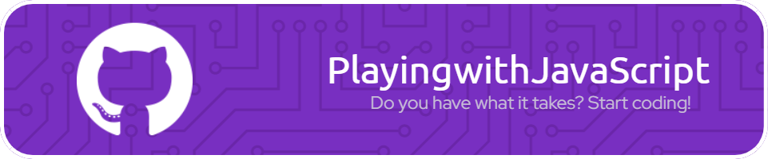

<a href="./README-pt-br.md">➡️ EN-US</a>

</img>

Um projeto na HacktoberFest para colocar à prova suas habilidades de frontend.

	
	
	
	
   
	
	
	

### Sobre

Este é um repositório para iniciantes com fins educacionais que funciona como um playground para você aperfeiçoar suas habilidades com HTML, CSS e, especialmente, JavaScript, enquanto interage com o código dos outros. Celebremos o código aberto colocando a mão na massa e aprendendo de forma colaborativa!

### Features
* [x] Interativo
* [x] Colaborativo
* [x] Divertido

### Linguagens e ferramentas que você vai precisar

### O que é o HacktoberFest?

O Hacktoberfest é um festival virtual que ocorre durante todo o mês de Outubro, realizado pela DigitalOcean, appwrite and docker, para celebrar as contribuições e incentivar a participação na comunidade de código aberto.
É a maneira mais fácil para começar no universo open-source e todos são bem-vindos para participar!

[Clique aqui para se registrar](https://hacktoberfest.com/), faça 4 Pull Requests válidos até o final do mês e ganhe SWAG grátis!

### Como este repo funciona

Este repositório é um playground baseado em desafios. Na [seção de issues](https://github.com/anasilveira9787/playing-with-Javascript/issues), você encontrará várias tarefas ou desafios que o convidam a interagir com o código existente. Escolha uma e peça para ser atribuído (assigned). Realize a tarefa usando suas habilidades de HTML, CSS e JavaScript, abra um Pull Request e voilà!

Se você tiver alguma dúvida, use os comentários na issue para pedir ajuda à comunidade.

Não complete mais de um desafio, deixe que outros devs participem.

Você também pode contribuir sugerindo mais desafios através de issues ou respondendo perguntas na seção de comentários.

### Passo-a-Passo

1. Escolha uma issue para trabalhar
2. Faça um fork do projeto
3. Clone para sua máquina local
	`git clone https://github.com/[user-name]/playing-with-Javascript.git`
4. Vá para o diretório do projeto
	`cd playing-with-Javascript`
6. Crie uma nova branch e mude para ela
  `git checkout -b yourFeature`
5. Faça suas alterações usando sua IDE de preferência
   `code .`
6. Stage e comite suas mudanças
   `git add .`
	 `git commit -m 'Add some amazing feature'`
7. Envie ao repositório remoto
   `git push -u origin yourFeature`
8. Abra um Pull Request e associe-o ao número escolhido, adicionando `Fix #[número da issue]` à descrição do PR

---

&nbsp;&nbsp; **Feito com ❤️ por [Ana Silveira](https://www.linkedin.com/in/anaccord), entre em contato!**

&nbsp;&nbsp;  Não esqueça de dar uma estrela ao projeto! ⭐   <a href="https://github.com/tgmarinho/README-ecoleta/stargazers">
&nbsp;&nbsp;  
</a>
